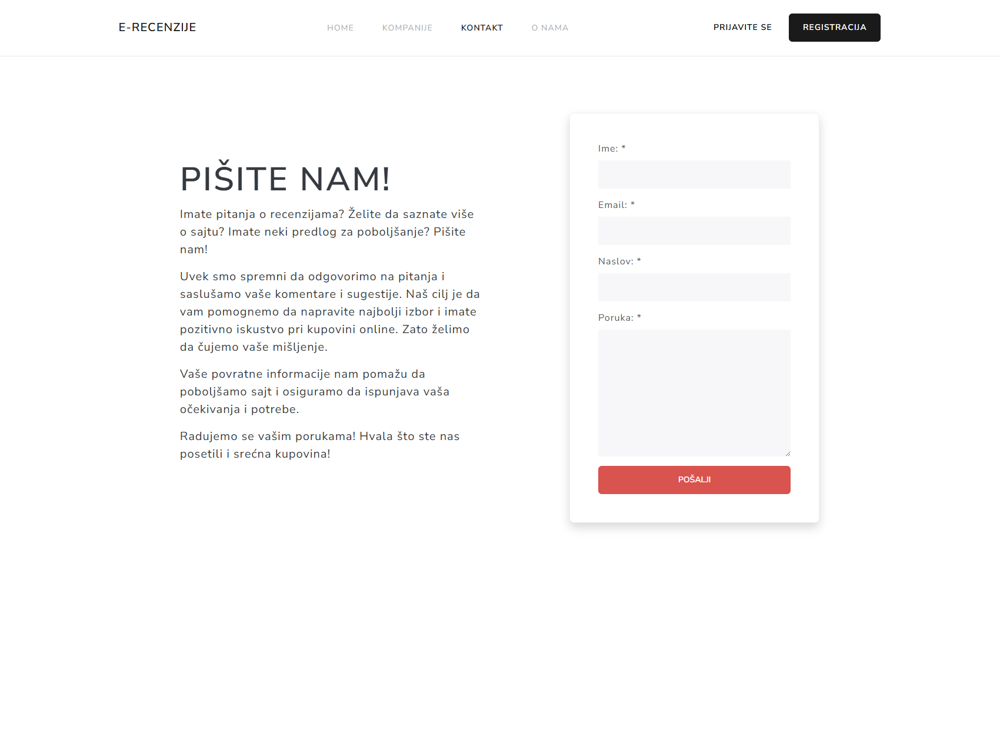

# Kupistika

Kupistika is an online store review platform designed to help users make informed purchasing decisions by providing genuine feedback from real customers. Our platform allows users to browse, review, and rate various online stores in a simple and efficient manner.

## Features

- **User Reviews**: Submit and read reviews from other customers.
- **Star Ratings**: Rate your experience with online stores using a simple 1-5 star rating system.
- **Store Listings**: Browse through a comprehensive list of online stores.
- **Search Functionality**: Quickly find specific stores or products.
- **User Authentication**: Sign up and log in to manage your reviews and preferences.

## Tech Stack

Kupistika is built using the following technologies:

- **Frontend**: HTML, CSS, JavaScript
- **Backend**: Python, Django

## Screenshots

### Landing Page

### Landing Page - Bottom half

### Company Detail Page

### Company Detail Page

### Company Detail Page

### Add A Review Page

### Add A Company Page

### Search Results Page

### Contact Page

### About Us Page

